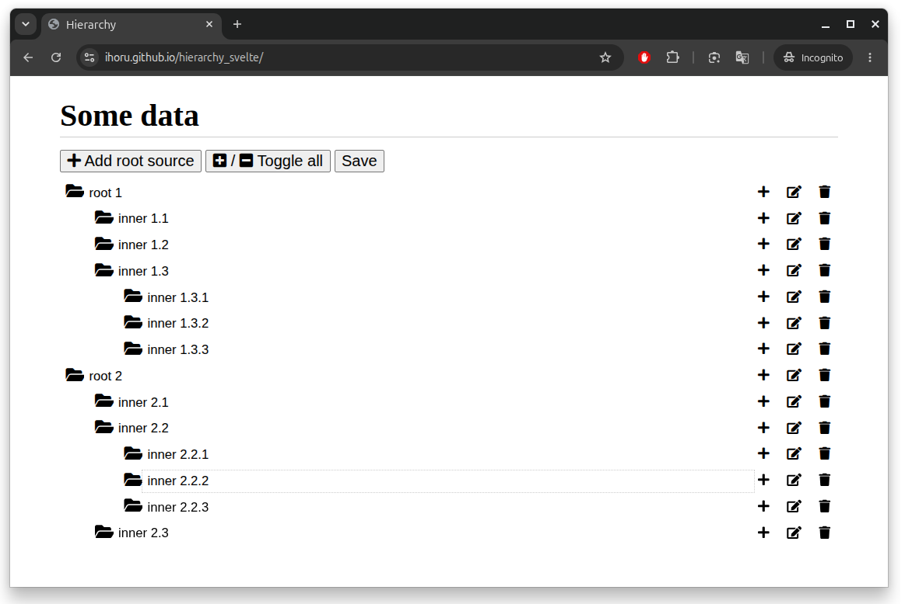

# Hierarchy

An interactive Svelte prototype for editing tree-shaped data in the browser.
It renders nested items recursively and lets you build, rename, organize, and
remove nodes at any depth.

[Try the live demo](https://ihoru.github.io/hierarchy_svelte/)



## Features

- Add root items and nested children.
- Rename every item inline.
- Expand or collapse individual branches.
- Open or close the entire hierarchy at once.
- Remove items together with their descendants.
- Serialize the hierarchy to clean JSON without UI-only state.

## How it works

The top-level `Hierarchy` component manages the collection and global actions.
Each `HierarchyItem` renders one node and uses Svelte's recursive component
support to display its children, allowing the same interface to handle trees of
arbitrary depth.

This repository is a front-end prototype: data is kept in memory, and the
**Save** button displays the serialized JSON so it can be inspected or connected
to a persistence layer later.

## Run locally

```sh
pnpm install
pnpm dev
```

Create a production build with:

```sh
pnpm build
```

## Built with

- [Svelte](https://svelte.dev/)
- [Vite](https://vitejs.dev/)
- [Font Awesome](https://fontawesome.com/)

## License

[MIT](LICENSE)
